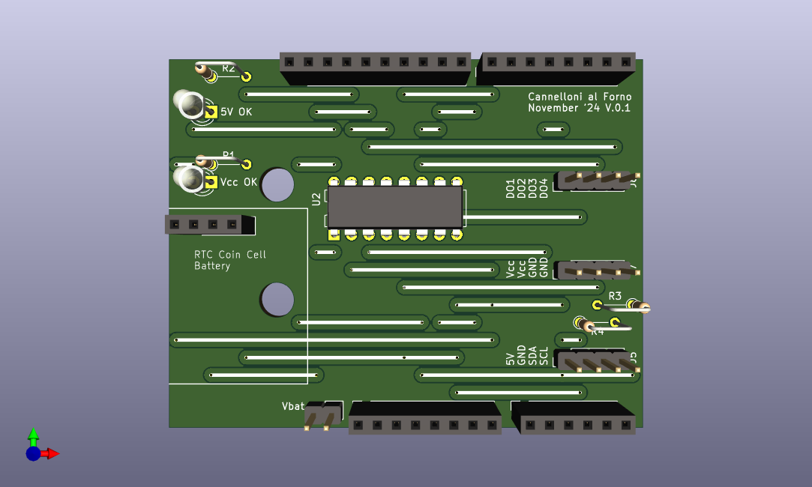
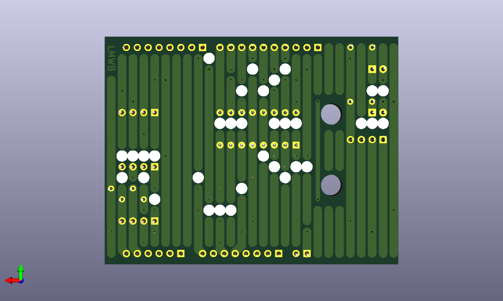
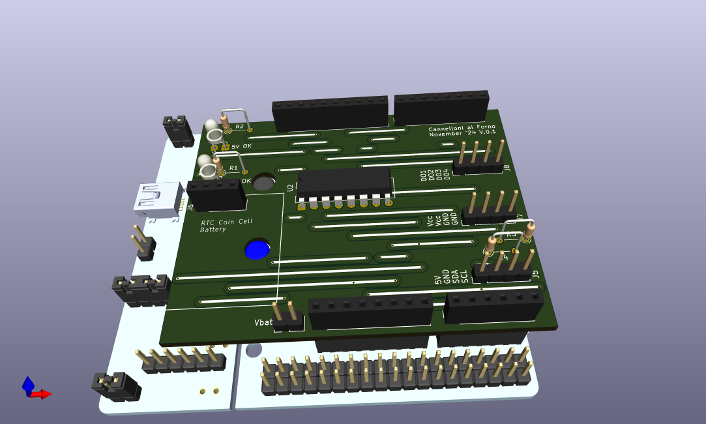

# Cannelloni-al-Forno
Timer Clock Arduino Shield and C-Library

# Description
I always wanted to use the world famous LD293D motor driver IC. Here I created a very simple application using this chip to build a timer clock that is able to drive some 12V loads.  
Since the LD293D is a THT device and the overall application i quite simple, I decided to build the hole board as THT as it was back in the days :) To give the board a little retro touch I gave the top and bottom layer a hole grid pcb design.  

# Real World Example
todo
- courtyard illumination
- Xmas deciration
- composition of Canneloni-al-Forno and LED_CC_Driver

# Features
- 12V input (powers Nucleo board as well)
- 4 digital outputs (Vout = Vinput)
- RTC with coin cell back up battery

# todo
- add some sort of remote access (wifi, can, RS485,..)
- add shunt to track total energy consuption
- use TI DRV89xx instead of LD293D

